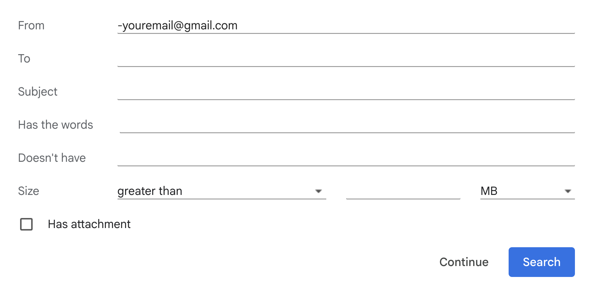

# AI-got-this-gmail-delegator 🤖

> **AI-powered Gmail assistant that automatically analyzes emails and drafts responses using Google's Gemini AI**

[](https://developers.google.com/apps-script)
[](https://ai.google.dev/)

## 🎯 What This Does

This Google Apps Script transforms your Gmail into an AI-powered email assistant that:

- **🔍 Automatically analyzes** incoming emails using Google's Gemini AI
- **🤖 Generates smart draft replies** for emails that need responses
- **🏷️ Intelligently categorizes** emails (AI-drafted, manual review, no reply needed)
- **📊 Logs everything** to Google Sheets for tracking and analytics
- **🧹 Manages Gmail labels** automatically to keep your inbox organized

## ✨ Key Features

- **🎯 Smart Decision Making**: AI determines if emails need replies, can be auto-drafted, or require manual attention
- **📝 Custom Writing Style**: Uses your personal writing style and knowledge base from Google Docs
- **🔄 Dual AI Support**: Works with both AI Studio API (API key) and Vertex AI (service account)
- **📈 Comprehensive Logging**: Tracks all decisions and actions in Google Sheets
- **🏷️ Label Management**: Automatic Gmail label organization with cleanup
- **🛡️ Error Handling**: Robust error handling and retry logic
- **⚡ Performance Optimized**: Lazy loading and caching for efficiency

## 🚀 Quick Start

### Prerequisites

- Google Workspace account
- Access to Google Apps Script
- Gemini AI credentials (API key or service account)
- Google Doc for knowledge base/context
- Google Sheet for logging

### 1. 📋 Setup Gmail Labels

Create these labels in your Gmail:

- `🆕 New-Email` - For emails to be processed
- `🤖 AI-Drafted` - For emails with AI-generated drafts
- `✍️ Needs-Manual-Reply` - For emails requiring manual review
- `⛔️ No-Reply-Needed` - For emails that don't need responses

### 2. 🔄 Create Gmail Filter

Create a Gmail filter to automatically assign the "🆕 New-Email" label to incoming messages:

1. **Open Gmail** and click the gear icon → "See all settings"
2. **Go to "Filters and Blocked Addresses"** tab
3. **Click "Create a new filter"**
4. **Set the filter criteria:**
   - **From**: `-youremail@gmail.com` (replace with your actual Gmail address)
   - **Has the words**: Leave empty
   - **Doesn't have**: Leave empty
5. **Click "Create filter"**
6. **Select these actions:**
   - ✅ **Apply the label**: Choose "🆕 New-Email"
   - ✅ **Never send it to Spam** (recommended)
   - ✅ **Always mark it as important** (optional)
7. **Click "Create filter"**



**🎯 Pro Tip**: You can also create more specific filters for different types of emails (e.g., only work emails, only emails from certain domains, etc.) by adjusting the "From" field criteria.

### 3. 🔧 Configure the Script

1. **Open Google Apps Script** and create a new project
2. **Copy the files** from this repository:

   - `Code.gs` - Main application logic
   - `Auth.gs` - Authentication configuration
   - `Gemini.gs` - AI integration
   - `appsscript.json` - Project configuration

3. **Update configuration** in `Code.gs`:

   ```javascript
   const CONTEXT_DOC_ID = "your-google-doc-id"; // Knowledge base document
   const LOGGING_SHEET_ID = "your-google-sheet-id"; // Logging spreadsheet
   const MY_WRITING_STYLE = "Your personal writing style here...";
   ```

4. **Configure AI credentials** in `Auth.gs`:

   ```javascript
   // Option A: AI Studio API Key
   const CREDENTIALS = "your-api-key-here";

   // Option B: Vertex AI Service Account
   const CREDENTIALS = {
     type: "service_account",
     project_id: "your-gcp-project-id",
     // ... rest of service account JSON
   };
   ```

### 4. 🎯 Set Up Your Knowledge Base

Create a Google Doc with:

- Your role and responsibilities
- Common email scenarios and responses
- Company policies and procedures
- Personal preferences and writing style
- Any specific context the AI should know

### 5. 📊 Create Logging Spreadsheet

Create a Google Sheet with these columns:

- Timestamp
- Email Link
- Subject
- Sender
- Label
- Reasoning
- Thread ID

### 6. ⚡ Set Up Triggers

1. **Manual trigger**: Run `processNewEmails()` to test
2. **Automatic trigger**: Set up a time-based trigger to run every 60 minutes, or however frequently you wish.

## 🔧 Configuration Options

### AI Model Settings

```javascript
const GEMINI_MODEL = "gemini-2.0-flash"; // or "gemini-2.5-flash"
```

### Writing Style

```javascript
const MY_WRITING_STYLE = `
Write in a clear, concise, and helpful tone. 
Be professional and friendly. 
Sign off with "Cheers, Zack".
`;
```

### Label Names

```javascript
const NEW_EMAIL_LABEL_NAME = "🆕 New-Email";
const DRAFTED_LABEL_NAME = "🤖 AI-Drafted";
const MANUAL_REPLY_LABEL_NAME = "✍️ Needs-Manual-Reply";
const NO_REPLY_NEEDED_LABEL_NAME = "⛔️ No-Reply-Needed";
```

## 📖 How It Works

### 1. 📧 Email Detection

- Monitors Gmail for emails with the "🆕 New-Email" label
- Processes the most recent message in each thread

### 2. 🧠 AI Analysis

- Loads your knowledge base from Google Docs
- Sends email content to Gemini AI for analysis
- AI determines if the email needs a response

### 3. 🎯 Decision Making

- **AI Draft**: Generates a draft reply using your writing style
- **Manual Review**: Flags for your attention
- **No Reply**: Marks as not needing a response

### 4. 🏷️ Label Management

- Applies appropriate labels based on AI decision
- Removes the "New-Email" label
- Cleans up any existing process labels

### 5. 📊 Logging

- Records all decisions and actions to Google Sheets
- Includes reasoning and metadata for tracking

## 🛠️ Available Functions

### Main Functions

- `processNewEmails()` - Main function to process all new emails
- `testGemini()` - Test the AI integration
- `reset()` - Reset authorization state

### Utility Functions

- `getCachedContext()` - Load knowledge base with caching
- `analyzeEmailWithAI()` - AI analysis of email content
- `createDraftReply()` - Generate Gmail draft
- `logEmailProcessing()` - Log to spreadsheet

## 🔍 Troubleshooting

### Common Issues

**❌ "Label does not exist"**

- Create the required Gmail labels manually
- Check label names match configuration

**❌ "Could not retrieve context"**

- Verify Google Doc ID is correct
- Check document permissions

**❌ "AI Studio API error"**

- Verify API key is valid
- Check API quotas and limits

**❌ "Service account access error"**

- Verify service account permissions
- Check GCP project configuration

### Debug Mode

The script includes comprehensive logging with emojis:

- 🚀 Process start
- 📧 Email analysis
- ✅ Success actions
- ❌ Error conditions
- 🧹 Cleanup operations

## 📈 Monitoring & Analytics

### Google Sheets Log

Track email processing with columns:

- **Timestamp**: When the email was processed
- **Email Link**: Direct link to the email
- **Subject**: Email subject line
- **Sender**: Who sent the email
- **Label**: What action was taken
- **Reasoning**: AI's reasoning for the decision
- **Thread ID**: Gmail thread identifier

### Performance Metrics

- Processing time per email
- Success/failure rates
- AI decision distribution
- Label usage statistics

## 🔒 Security & Privacy

- **No data storage**: Emails are processed in memory only
- **Google's security**: Runs on Google's secure infrastructure
- **API security**: Uses official Google APIs with proper authentication
- **Logging control**: You control what gets logged to Sheets

## 🤝 Contributing

1. Fork the repository
2. Create a feature branch
3. Make your changes
4. Test thoroughly
5. Submit a pull request

## 🙏 Acknowledgments

- **Google Apps Script** for the platform
- **Google Gemini AI** for the intelligence
- **Gmail API** for email integration
- **Google Sheets API** for logging

## 📞 Support

If you encounter issues:

1. Check the troubleshooting section
2. Review the Google Apps Script logs
3. Verify your configuration
4. Test with `testGemini()` function

---

**Made with ❤️ by Zack Akil**

_Your responsible AI email assistant that actually gets it done! 🚀_
